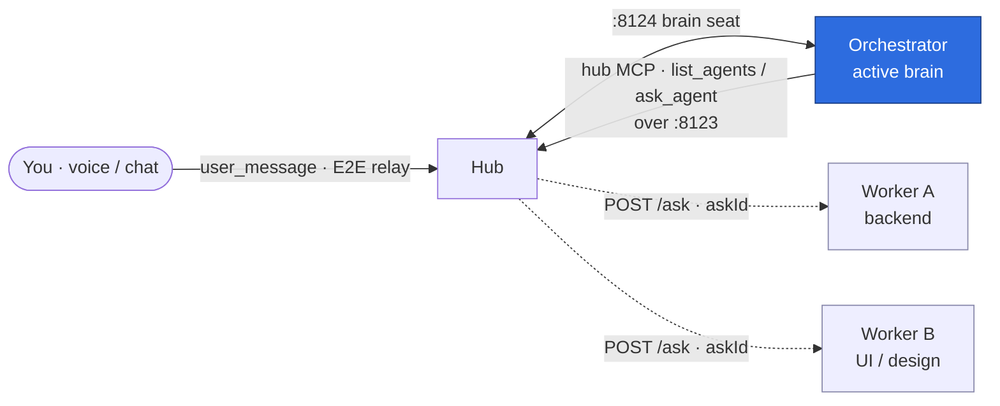
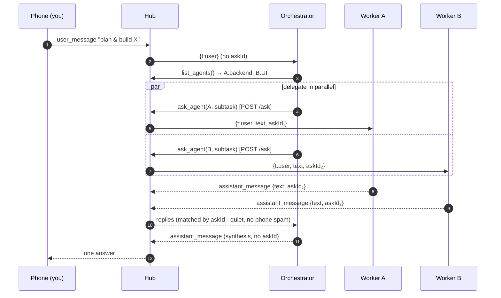
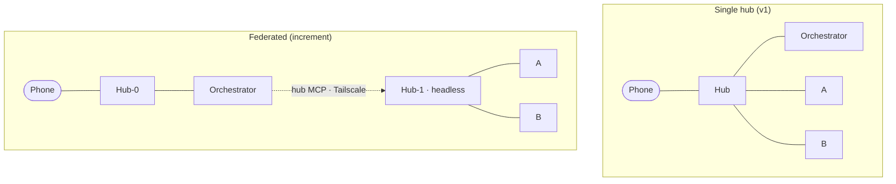

# Agent Orchestration

A hub has two **seats**: a *driver* (who gives instructions) and a *brain* (who answers). They are
symmetric. The phone is the usual driver; an **orchestrator agent** can occupy a driver seat too — so a
single agent you talk to can see your other agents and delegate work to them by strength.

## How it fits together



The orchestrator is just an agent that holds one extra tool — the `hub` MCP server. Workers never get
that tool, so they can't enumerate or drive each other: **the asymmetry is an opt-in grant, not an
ambient power.**

## A delegated task, step by step



## Topologies — same tool, different URL



You start single-hub (no new infrastructure). To scale out you change a base URL in the orchestrator's
config — the contract (`list_agents` + `ask_agent`) is identical.

## Safety & correctness mechanisms

| Mechanism | What it protects against |
|-----------|--------------------------|
| **Opt-in tool grant** | Workers can't orchestrate each other — only an agent given the `hub` tool can. |
| **Loopback bind by default** (`PANEL_HOST`/`AGENT_HOST`) | The driver port isn't exposed to the LAN/public unless you opt in for federation. |
| **`askId` correlation** | A reply is matched to its exact subtask — a slow/timed-out worker's late answer can never cross-wire into another task. |
| **Quiet delegation** | A delegated sub-answer is routed only to the orchestrator, never broadcast into your chat. |
| **Per-worker serialization** | One turn in flight per worker — protects a CLI agent's single resumed session from corruption. |
| **Hop-count loop-breaker** (`X-Ask-Depth`) | Orchestrator→orchestrator cycles terminate instead of running away. |
| **Self-delegation guard** | On a phone-backed hub, the user-facing brain can't be asked to delegate to itself. |
| **Timeout + disconnect handling** | An ask always resolves — with the answer, a timeout, or a clean "disconnected" — never hangs. |

## Running one

```bash
# hub + two workers, each self-describing its strength:
pnpm panel
AGENT_NAME=Backend AGENT_DESC="SQL & backend APIs" pnpm agent:claude
AGENT_NAME=Design  AGENT_DESC="UI & copy"          pnpm agent:omp
# the orchestrator (active brain) that can delegate to them:
pnpm agent:orchestrator
```
