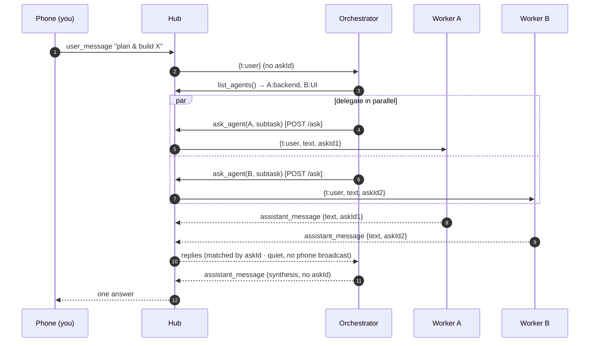
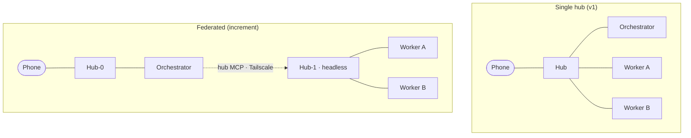

# Agent Orchestration

A hub has two **seats**: a *driver* (who gives instructions) and a *brain* (who answers). They are
symmetric. The phone is the usual driver; an **orchestrator harness** can occupy a driver seat too — so a
single harness you talk to can see your other harnesses and delegate work to them by strength.

## How it fits together


The orchestrator is just a harness that holds one extra tool — the `hub` MCP server (`backbone/src/hub-mcp.ts`).
Worker harnesses never get that tool, so they cannot enumerate or drive each other: **the asymmetry is an
opt-in grant, not an ambient power.**

## A delegated task, step by step



The hub matches each reply to its subtask by **`askId`** — the correlation token it stamps on every
delegated turn. A reply carrying an `askId` is routed quietly back to the orchestrator and never shown in
your chat; a reply with no `askId` (the orchestrator's own synthesis, or any normal message) is delivered
to you as usual.

## Topologies — same tool, different URL



You start single-hub (no new infrastructure): the orchestrator is the active brain of your hub, the
workers are non-active siblings on the same hub, and the orchestrator's `hub` tool points back at its own
hub (`http://127.0.0.1:8123`). To scale out, you change a base URL in the orchestrator's config — the
contract (`list_agents` + `ask_agent`) is identical whether the workers share its hub or live on another.

## The driver contract

Two verbs are the whole seam between an orchestrator and a hub:

| Verb | HTTP | Returns |
|------|------|---------|
| `list_agents()` | `GET /status` | `{ hub, agents: [{ id, name, description, active, kind }] }` — connected harnesses + their strengths |
| `ask_agent(agent, message)` | `POST /ask` | `{ reply }` — delegate a subtask to a worker and await its answer |

Because both verbs are realized hub-side, the transport can be swapped later (an E2E-relay-paired
orchestrator for untrusted networks) without changing the orchestrator at all.

## Safety & correctness mechanisms

Every row maps to real code in this repo.

| Mechanism | Protects against | Where |
|-----------|------------------|-------|
| **Opt-in tool grant** | Workers orchestrating each other — only a harness given the `hub` tool can delegate | `AGENT_HUBS` → `buildHubServers` (`backbone/src/agent-runner.ts`) |
| **Loopback bind by default** | The driver/harness ports being exposed to the LAN/public unless you opt in | `PANEL_HOST` / `AGENT_HOST` = `127.0.0.1` (`backbone/src/panel.ts`) |
| **`askId` correlation** | A slow/timed-out worker's late answer cross-wiring into another subtask | match by `askId`, ignore unknown/stale (`backbone/src/delegate.ts`) |
| **Quiet delegation** | A delegated sub-answer leaking into your chat | askId-routed reply returns before any phone broadcast (`backbone/src/panel.ts`) |
| **Per-worker serialization** | A CLI harness's single resumed session being corrupted by concurrent turns | one in-flight turn per worker (`backbone/src/delegate.ts`) |
| **Hop-count loop-breaker** | Orchestrator→orchestrator cycles running away | `X-Ask-Depth` header, rejected past `MAX_ASK_DEPTH` (default 8) → `508` |
| **Self-delegation guard** | The user-facing brain being asked to delegate to itself | `POST /ask` → `400` when target is the active harness on a phone-backed hub |
| **Timeout + disconnect** | A delegated ask hanging forever | resolves with the answer, `(no reply within timeout)` (60s), or `(harness disconnected)` (`delegate.ts`) |

## Running one

```bash
# Hub + two workers, each self-describing its strength:
pnpm panel
AGENT_NAME=Backend AGENT_DESC="SQL & backend APIs" pnpm agent:claude
AGENT_NAME=Design  AGENT_DESC="UI & copy"          pnpm agent:omp

# The orchestrator (active brain) that can delegate to them:
pnpm agent:orchestrator        # = AGENT_HUBS=self=http://127.0.0.1:8123 agent:claude
```

Now talk to the orchestrator from your phone. Ask it for something that spans both workers' strengths and
it will `list_agents`, split the task, `ask_agent` each by name, and reply with the synthesis — while the
workers' intermediate answers stay off your chat.
