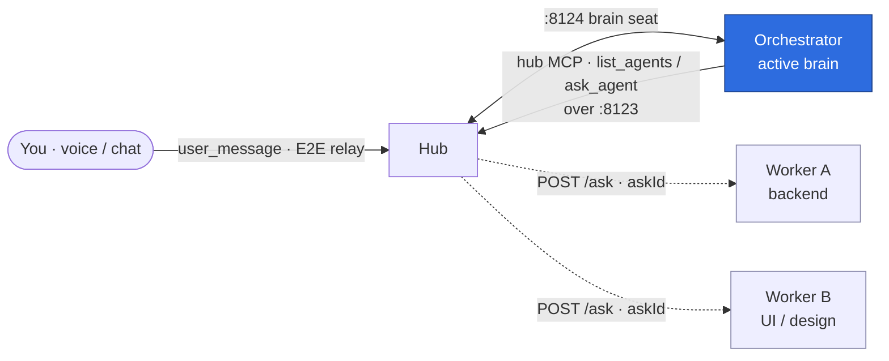
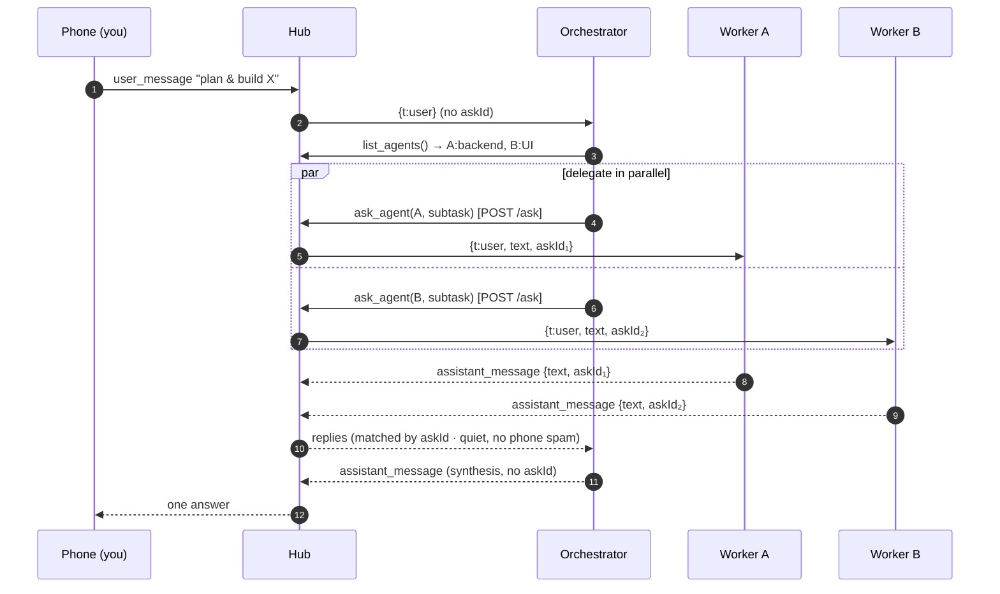
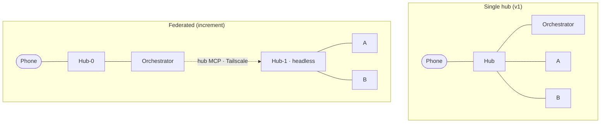

# Agent Orchestrator via the Hub's Driver Seat — Implementation Plan

> **For agentic workers:** REQUIRED SUB-SKILL: Use superpowers:subagent-driven-development (recommended) or superpowers:executing-plans to implement this plan task-by-task. Steps use checkbox (`- [ ]`) syntax for tracking.

**Goal:** Let an agent occupy a hub's driver seat so a single orchestrator can list a hub's worker roster and delegate subtasks to workers (by id/name and strength), then synthesize one reply to the user.

**Architecture:** A hub exposes two driver verbs over its existing HTTP (`:8123`) — `list_agents` (via `GET /status`) and `ask_agent` (via a new `POST /ask`). Replies are correlated to delegated turns by an additive `askId` wire field (not queue position), routed quietly to the waiting caller (never broadcast to the phone). A new I/O-free `delegate.ts` owns the addressed/serialized/awaited delegation logic; a new `hub-mcp.ts` wraps the two verbs as MCP tools so any CLI agent becomes an orchestrator by config (`AGENT_HUBS`).

**Tech Stack:** Node + TypeScript run via `tsx`; tests via `node:test` + `node:assert/strict` (`tsx --test test/*.test.ts`); `ws` WebSockets; `@modelcontextprotocol/sdk` for MCP; `zod`. No new runtime dependencies.

## Global Constraints

- **Test runner:** `node:test`. Run the suite with `pnpm test` from `backbone/` (`tsx --test test/*.test.ts`). Type-check with `pnpm typecheck`. New tests are `backbone/test/<name>.test.ts`.
- **No new runtime dependencies.** Use what `backbone/package.json` already has.
- **Backward compatibility is mandatory:** `POST /say`, the Android app, the relay wire protocol, and every existing test must keep passing untouched. The `askId` field is additive — the phone/`/say` path sends none and ignores any echoed one.
- **Scope = single-hub v1.** The orchestrator is the active brain of the user's hub; workers are non-active siblings on the same hub; its `hub` MCP points at `http://127.0.0.1:8123`. Multi-hub federation (a phoneless HUB-1 reached cross-host) needs a driver-only/headless boot and is an explicit follow-on — **do not** build the null-`bus`/headless branch here. The `startPanel` export (Task 2) and `X-Ask-Depth` loop-breaker (Task 4/5) are still done now.
- **Bind loopback by default:** servers bind `127.0.0.1` unless `PANEL_HOST`/`AGENT_HOST` override (Task 2). This closes the current all-interfaces exposure.
- **ponytail discipline:** smallest diff that works; mark deliberate ceilings with `// ponytail:` comments.
- **Model ids unchanged:** leave agent defaults (`claude-opus-4-8`) as-is.
- **Spec:** `docs/superpowers/specs/2026-06-27-agent-orchestrator-driver-seat-design.md` is the source of truth; §-references below point into it.
- **Line numbers are approximate.** All `panel.ts`/`agent-runner.ts` line references were taken against an earlier tree; concurrent WIP (hub naming, manual pairing, `agent-verify`) shifted `panel.ts` by ~+180 lines. **Match every `Replace … with:` block by its verbatim OLD-snippet content, not by line number** — the OLD snippets were re-verified current as of HEAD `5e0256f`. If an OLD snippet does not match, STOP and report (do not guess a nearby line).

---

## File Structure

| File | Responsibility | Task |
|------|----------------|------|
| `backbone/src/delegate.ts` | **new** — I/O-free, askId-correlated, per-agent-serialized delegation core | 1 |
| `backbone/test/delegate.test.ts` | **new** — unit tests for the delegation core | 1 |
| `backbone/src/panel.ts` | export `startPanel(opts)`; loopback bind; `description` plumbing; `POST /ask`; wire `delegator`; askId reply routing; `onGone` on close; `select_agent` pending-guard | 2,3,4 |
| `backbone/test/panel-boot.test.ts` | **new** — boots `startPanel` against a test relay; regression for `/status` + `/say` | 2 |
| `backbone/test/orchestrator-ask.test.ts` | **new** — `/ask` routing, askId, no-broadcast, active-flip, guards | 3,4 |
| `backbone/src/agent-runner.ts` | `description`+`AGENT_DESC` in `hello`; read+echo `askId`; export `buildHubServers` | 3,4,6 |
| `backbone/src/agent.ts` | `AGENT_DESC` in `hello`; read+echo `askId` | 3,4 |
| `backbone/src/hub-mcp.ts` | **new** — `list_agents` + `ask_agent` MCP server (`makeHubMcpServer` + stdio main) | 5 |
| `backbone/test/hub-mcp.test.ts` | **new** — tools against a canned HTTP stub | 5 |
| `backbone/test/orchestrator-hubs.test.ts` | **new** — `buildHubServers` parsing | 6 |
| `backbone/src/agent-cli.ts` / `agent-omp.ts` | `AGENT_HUBS` → hub MCP servers + orchestrator system addendum | 6 |
| `backbone/package.json` | `agent:orchestrator` script | 6 |
| `docs/orchestration.md` | **new** — presentation-grade architecture + diagrams + safety | 7 |
| `README.md`, `.planning/codebase/ARCHITECTURE.md` | orchestrator section + architecture addendum | 7 |

---

## Task 1: `delegate.ts` — the delegation core

**Files:**
- Create: `backbone/src/delegate.ts`
- Test: `backbone/test/delegate.test.ts`

**Interfaces:**
- Consumes: nothing (pure module).
- Produces:
  - `interface DelegateDeps { send: (agentId: string, text: string, askId: string) => void; newId: () => string; timeoutMs?: number }`
  - `function makeDelegator(deps: DelegateDeps): Delegator`
  - `interface Delegator { ask(id: string, text: string): Promise<string>; onReply(id: string, askId: string | undefined, reply: string): boolean; onGone(id: string): void; pending(id: string): number }`
  - Sentinel reply strings: `"(no reply within timeout)"`, `"(agent disconnected)"`.

- [ ] **Step 1: Write the failing test**

Create `backbone/test/delegate.test.ts`:

```ts
import { test } from "node:test";
import assert from "node:assert/strict";
import { makeDelegator } from "../src/delegate.ts";

function harness(timeoutMs = 1000) {
  const sends: { id: string; text: string; askId: string }[] = [];
  let n = 0;
  let throwOnText: string | null = null;
  const d = makeDelegator({
    newId: () => `ask${++n}`,
    timeoutMs,
    send: (id, text, askId) => {
      if (throwOnText !== null && text === throwOnText) throw new Error("closed");
      sends.push({ id, text, askId });
    },
  });
  return { d, sends, setThrow: (t: string | null) => { throwOnText = t; } };
}

test("single ask resolves with the reply matched by askId", async () => {
  const { d, sends } = harness();
  const p = d.ask("A", "hi");
  assert.equal(sends.length, 1);
  assert.equal(d.onReply("A", sends[0].askId, "hello back"), true);
  assert.equal(await p, "hello back");
});

test("two asks to the same agent serialize: one in flight, FIFO", async () => {
  const { d, sends } = harness();
  const p1 = d.ask("A", "first");
  const p2 = d.ask("A", "second");
  assert.equal(sends.length, 1);
  assert.equal(sends[0].text, "first");
  d.onReply("A", sends[0].askId, "r1");
  assert.equal(await p1, "r1");
  assert.equal(sends.length, 2);
  assert.equal(sends[1].text, "second");
  d.onReply("A", sends[1].askId, "r2");
  assert.equal(await p2, "r2");
});

test("asks to different agents run in parallel", () => {
  const { d, sends } = harness();
  d.ask("A", "a"); d.ask("B", "b");
  assert.deepEqual(sends.map((s) => s.id).sort(), ["A", "B"]);
});

test("timeout resolves the job; a late reply with the timed-out askId is ignored", async () => {
  const { d, sends } = harness(20);
  const p1 = d.ask("A", "slow");
  const askId1 = sends[0].askId;
  const p2 = d.ask("A", "next");
  assert.equal(await p1, "(no reply within timeout)");
  assert.equal(sends.length, 2);
  const askId2 = sends[1].askId;
  assert.equal(d.onReply("A", askId1, "late-first-answer"), false);
  d.onReply("A", askId2, "second-answer");
  assert.equal(await p2, "second-answer");
});

test("a duplicate reply with an already-resolved askId is a no-op", async () => {
  const { d, sends } = harness();
  const p = d.ask("A", "x");
  assert.equal(d.onReply("A", sends[0].askId, "first"), true);
  assert.equal(await p, "first");
  assert.equal(d.onReply("A", sends[0].askId, "second"), false);
});

test("a throwing send fails that job as disconnected, no pending timer", async () => {
  const { d, sends, setThrow } = harness();
  const p1 = d.ask("A", "ok");
  d.onReply("A", sends[0].askId, "r1");
  await p1;
  setThrow("boom");
  const p2 = d.ask("A", "boom");
  assert.equal(await p2, "(agent disconnected)");
  assert.equal(d.pending("A"), 0);
});

test("onGone rejects all queued asks; onReply unknown askId returns false", async () => {
  const { d } = harness();
  const p1 = d.ask("A", "a");
  const p2 = d.ask("A", "b");
  d.onGone("A");
  assert.equal(await p1, "(agent disconnected)");
  assert.equal(await p2, "(agent disconnected)");
  assert.equal(d.pending("A"), 0);
  assert.equal(d.onReply("A", "nope", "x"), false);
  assert.equal(d.onReply("A", undefined, "x"), false);
});
```

- [ ] **Step 2: Run test to verify it fails**

Run: `cd backbone && pnpm test -- --test-name-pattern="askId"` (or `pnpm test`).
Expected: FAIL — `Cannot find module '../src/delegate.ts'`.

- [ ] **Step 3: Write the implementation**

Create `backbone/src/delegate.ts`:

```ts
/**
 * delegate.ts — addressed, serialized, askId-correlated delegation core. No sockets, no globals.
 *
 * The hub uses this to forward a user turn to a NAMED worker agent and await that worker's reply,
 * keeping at most ONE turn in flight per worker (CLI agents keep a single --resume/--continue session,
 * so concurrent turns to one worker would corrupt it). Replies correlate to jobs by `askId`, NOT by
 * queue position: a worker that "timed out" keeps running (agent-runner never cancels a turn) and WILL
 * emit late — only an askId match makes that safe. Different workers run in parallel.
 */
export interface DelegateDeps {
  /** Deliver a delegated turn. MUST throw if the agent's socket is missing/closed. */
  send: (agentId: string, text: string, askId: string) => void;
  /** Mint a unique correlation id (panel: randomUUID; tests: a counter). */
  newId: () => string;
  /** Per-job reply timeout. Default 60s. */
  timeoutMs?: number;
}

interface Job { askId: string; text: string; resolve: (r: string) => void; timer: ReturnType<typeof setTimeout> | null; sent: boolean }

export interface Delegator {
  ask(id: string, text: string): Promise<string>;
  /** true ⇒ the reply matched an outstanding ask (caller suppresses the phone broadcast). */
  onReply(id: string, askId: string | undefined, reply: string): boolean;
  onGone(id: string): void;
  pending(id: string): number;
}

export function makeDelegator(deps: DelegateDeps): Delegator {
  const timeoutMs = deps.timeoutMs ?? 60_000;
  const queues = new Map<string, Job[]>(); // agentId -> FIFO; at most one `sent` job in flight

  const finish = (id: string, askId: string, reply: string) => {
    const q = queues.get(id);
    if (!q) return;
    const i = q.findIndex((j) => j.askId === askId);
    if (i < 0) return; // unknown / already-resolved (late or duplicate) -> ignore
    const [job] = q.splice(i, 1);
    if (job.timer) clearTimeout(job.timer);
    job.resolve(reply);
    if (q.length) pump(id); else queues.delete(id);
  };

  const pump = (id: string) => {
    const q = queues.get(id);
    if (!q?.length) return;
    const job = q[0];
    if (job.sent) return; // one in flight already
    job.sent = true;
    try {
      deps.send(id, job.text, job.askId); // send BEFORE arming the timer
    } catch {
      finish(id, job.askId, "(agent disconnected)");
      return;
    }
    job.timer = setTimeout(() => finish(id, job.askId, "(no reply within timeout)"), timeoutMs);
  };

  return {
    ask(id, text) {
      const askId = deps.newId();
      return new Promise<string>((resolve) => {
        const q = queues.get(id) ?? [];
        queues.set(id, q);
        q.push({ askId, text, resolve, timer: null, sent: false });
        pump(id); // no-op if another job is in flight
      });
    },
    onReply(id, askId, reply) {
      if (!askId) return false;
      const q = queues.get(id);
      if (!q?.some((j) => j.askId === askId)) return false;
      finish(id, askId, reply);
      return true;
    },
    onGone(id) {
      const q = queues.get(id);
      if (!q) return;
      queues.delete(id);
      for (const j of q) { if (j.timer) clearTimeout(j.timer); j.resolve("(agent disconnected)"); }
    },
    pending(id) { return queues.get(id)?.length ?? 0; },
  };
}
```

- [ ] **Step 4: Run test to verify it passes**

Run: `cd backbone && pnpm test`
Expected: PASS — all delegate tests green, existing suite unaffected.

- [ ] **Step 5: Commit**

```bash
git add backbone/src/delegate.ts backbone/test/delegate.test.ts
git commit -m "feat(hub): askId-correlated delegation core (delegate.ts)"
```

---

## Task 2: `startPanel(opts)` export + loopback bind

Extract the bootable server out of `main()` so tests (and, later, a headless hub) can start it with injected identity/relay/ports, and bind loopback by default.

**Files:**
- Modify: `backbone/src/panel.ts` (the `main()` function, `~902–1642`; the `listen` at `1641`; the `WebSocketServer` at `1171`)
- Test: `backbone/test/panel-boot.test.ts`

**Interfaces:**
- Consumes: existing `BusEndpoint` (`./peer.ts`), `Identity` (`./crypto.ts`), `WebSocket`/`WebSocketServer` (`ws`).
- Produces:
  - `interface StartPanelOpts { identity?: Identity; peerEdPub?: string; relayUrl?: string; host?: string; httpPort?: number; agentPort?: number }`
  - `export async function startPanel(opts?: StartPanelOpts): Promise<{ http: import("node:http").Server; agentWss: import("ws").WebSocketServer; close(): Promise<void> }>` — `close()` resolves after both servers and the bus are shut. (The returned object gains `delegator` in Task 4.)

- [ ] **Step 1: Write the failing test**

Create `backbone/test/panel-boot.test.ts`:

```ts
import { test, before, after, beforeEach, afterEach } from "node:test";
import assert from "node:assert/strict";
import { WebSocket } from "ws";
import os from "node:os";
import fs from "node:fs";
import path from "node:path";
import { createRelay, type Relay } from "../src/relay.ts";
import { PhoneSim } from "../src/phone-sim.ts";
import { ready, generateIdentity } from "../src/crypto.ts";
import { startPanel } from "../src/panel.ts";

const delay = (ms: number) => new Promise((r) => setTimeout(r, ms));
let home: string;
before(async () => {
  await ready();
  // Hermetic config: point loadCfg() at a temp agent.json so tests don't require a real ~/.agentic-android one.
  home = fs.mkdtempSync(path.join(os.tmpdir(), "agentic-test-"));
  process.env.AGENTIC_HOME = home;
  fs.writeFileSync(path.join(home, "agent.json"), JSON.stringify({ self: { edPub: "test-edpub", fp: "test-fp" }, relayUrl: "http://127.0.0.1:0" }));
});
after(() => { try { fs.rmSync(home, { recursive: true, force: true }); } catch { /* */ } });

let relay: Relay, panel: Awaited<ReturnType<typeof startPanel>>, phone: PhoneSim, httpPort: number, agentPort: number;

beforeEach(async () => {
  relay = createRelay();
  const port = await relay.listen();
  const url = `http://127.0.0.1:${port}`;
  const HUB = generateIdentity();   // the hub's own identity
  const PHONE = generateIdentity(); // the paired phone
  phone = new PhoneSim(PHONE, HUB.edPub, url);
  await phone.connect();
  panel = await startPanel({ identity: HUB, peerEdPub: PHONE.edPub, relayUrl: url, httpPort: 0, agentPort: 0 });
  httpPort = (panel.http.address() as any).port;
  agentPort = (panel.agentWss.address() as any).port;
});
afterEach(async () => { await panel.close(); phone.close(); relay.close(); });

test("GET /status responds and reports the hub is up", async () => {
  const r = await fetch(`http://127.0.0.1:${httpPort}/status`).then((x) => x.json());
  assert.ok("agents" in r, "status has an agents array");
});

test("an agent can connect and /say round-trips through it (regression)", async () => {
  const ws = new WebSocket(`ws://127.0.0.1:${agentPort}`);
  await new Promise<void>((res) => ws.on("open", () => res()));
  ws.send(JSON.stringify({ t: "hello", name: "Echo" }));
  ws.on("message", (raw) => {
    const m = JSON.parse(raw.toString());
    if (m.t === "selftest") { ws.send(JSON.stringify({ t: "selftest_ok", token: m.token })); return; } // pass the hub's verifier probe
    if (m.t === "user") ws.send(JSON.stringify({ t: "event", topic: "assistant_message", data: { text: `echo:${m.text}` } }));
  });
  await delay(50);
  const r = await fetch(`http://127.0.0.1:${httpPort}/say`, {
    method: "POST", headers: { "content-type": "application/json" }, body: JSON.stringify({ text: "ping" }),
  }).then((x) => x.json());
  assert.equal(r.reply, "echo:ping");
  ws.close();
});
```

- [ ] **Step 2: Run test to verify it fails**

Run: `cd backbone && pnpm test -- --test-name-pattern="/status responds"`
Expected: FAIL — `startPanel` is not exported from `panel.ts`.

- [ ] **Step 3: Refactor `panel.ts` — extract `startPanel`**

Make these exact edits in `backbone/src/panel.ts`:

3a. Add `Identity` to the existing crypto import. Replace line `23`:

```ts
import { ready } from "./crypto.ts";
```

with:

```ts
import { ready, type Identity } from "./crypto.ts";
```

3b. Replace the head of `main()` — lines `902–913` **verbatim** (note `await ready()`, `loadEvents()`, `loadConversation()` — they move into `startPanel`):

```ts
async function main() {
  await ready();
  const cp = configPath();
  if (!fs.existsSync(cp)) { console.error("No agent.json — pair first."); process.exit(1); }
  const cfg = loadCfg();
  if (!cfg.peerEdPub) { console.error("Not paired (no peerEdPub)."); process.exit(1); }
  loadEvents();
  loadConversation();

  const bus = new BusEndpoint({ self: cfg.self, peerEdPub: cfg.peerEdPub, relayUrl: cfg.relayUrl });
  await bus.connect();
  logEvent("connection", `connected to relay ${cfg.relayUrl}`, { relayUrl: cfg.relayUrl });
```

with (the pairing gate moves to a new `main()` in step 3e; `startPanel` keeps `ready`/`loadEvents`/`loadConversation`):

```ts
export interface StartPanelOpts {
  identity?: Identity; peerEdPub?: string; relayUrl?: string;
  host?: string; httpPort?: number; agentPort?: number;
}

export async function startPanel(opts: StartPanelOpts = {}) {
  await ready();
  const cfg = loadCfg();
  const self = opts.identity ?? cfg.self;
  const peerEdPub = opts.peerEdPub ?? cfg.peerEdPub!;
  const relayUrl = opts.relayUrl ?? cfg.relayUrl;
  const HOST = opts.host ?? process.env.PANEL_HOST ?? "127.0.0.1";
  loadEvents();
  loadConversation();

  const bus = new BusEndpoint({ self, peerEdPub, relayUrl });
  await bus.connect();
  logEvent("connection", `connected to relay ${relayUrl}`, { relayUrl });
```

> Only the bus-identity refs change to the `self`/`relayUrl` locals. Every other `cfg.*` read
> (`cfg.self.fp`/`cfg.relayUrl` in the pairing payload, `/status`, `hub_identity`, the listen log) stays
> as-is — `cfg` is still defined. `// ponytail:` injected identity governs **only the bus**; the
> pairing/identity/display surfaces keep reading on-disk `cfg`. That's fine for v1: the tests inject a
> stub `cfg` via `AGENTIC_HOME` (see each test's `before` hook) and never assert on those surfaces. If a
> future need makes injected identity authoritative everywhere, route those reads through the locals too.

3c. The agent-WS port (currently `const AGENT_PORT = Number(process.env.AGENT_PORT ?? 8124);`, `~942`) → use the opt and bind host. Replace:

```ts
  const AGENT_PORT = Number(process.env.AGENT_PORT ?? 8124);
```
```ts
  const agentWss = new WebSocketServer({ port: AGENT_PORT });
```

with:

```ts
  const AGENT_PORT = opts.agentPort ?? Number(process.env.AGENT_PORT ?? 8124);
```
```ts
  const agentWss = new WebSocketServer({ port: AGENT_PORT, host: process.env.AGENT_HOST ?? HOST });
```

3c-2. Capture the verifier sweep interval so `close()` can stop it (else the test leaks an open handle). The agent-verify WIP added, just above the `agentWss` line, `  setInterval(() => verifier.sweep(), 10000);`. Replace it:

```ts
  setInterval(() => verifier.sweep(), 10000);
```

with:

```ts
  const sweepTimer = setInterval(() => verifier.sweep(), 10000);
```

3d. The HTTP port — replace line `1354`:

```ts
  const PORT = Number(process.env.PANEL_PORT ?? 8123);
```

with:

```ts
  const PORT = opts.httpPort ?? Number(process.env.PANEL_PORT ?? 8123);
```

3e. The listen call + the end of the function — replace lines `1646–1647` **verbatim**:

```ts
  server.listen(PORT, () => console.error(`panel: http://127.0.0.1:${PORT}  (${caps.length} caps, relay ${cfg.relayUrl}, ${events.length} events loaded)`));
}
```

with (awaits the bind so callers know it's up; `HOST`-bound; returns a handle; adds the thin `main()` wrapper that keeps the pairing gate). **Note:** the returned `delegator` field is added in Task 4 — omit it here:

```ts
  await new Promise<void>((res) => server.listen(PORT, HOST, () => { console.error(`panel: http://${HOST}:${(server.address() as any).port}  (${caps.length} caps, relay ${relayUrl}, ${events.length} events loaded)`); res(); }));
  return {
    http: server,
    agentWss,
    async close() {
      clearInterval(sweepTimer);
      await new Promise<void>((r) => agentWss.close(() => r()));
      await new Promise<void>((r) => server.close(() => r()));
      bus.close();
    },
  };
}

async function main() {
  const cp = configPath();
  if (!fs.existsSync(cp)) { console.error("No agent.json — pair first."); process.exit(1); }
  const cfg = loadCfg();
  if (!cfg.peerEdPub) { console.error("Not paired (no peerEdPub)."); process.exit(1); }
  await startPanel();
}
```

(Leave the existing `if (process.argv[1] && import.meta.url === pathToFileURL(process.argv[1]).href) { await main(); }` guard as the last lines.)

- [ ] **Step 4: Run tests to verify they pass**

Run: `cd backbone && pnpm test && pnpm typecheck`
Expected: PASS — `panel-boot.test.ts` green; existing suite + typecheck still green.

- [ ] **Step 5: Commit**

```bash
git add backbone/src/panel.ts backbone/test/panel-boot.test.ts
git commit -m "refactor(hub): export startPanel(opts); bind 127.0.0.1 by default"
```

---

## Task 3: Roster carries a `description` (strength)

**Files:**
- Modify: `backbone/src/agent-runner.ts:24` (interface) and `:57` (hello send)
- Modify: `backbone/src/agent.ts` (the `hello` send, `~77`)
- Modify: `backbone/src/panel.ts` (hello handler `~1175`; `rosterList` `955`; `/status` payload `~1372`)
- Test: `backbone/test/orchestrator-ask.test.ts` (created here; extended in Task 4)

**Interfaces:**
- Consumes: `startPanel` (Task 2).
- Produces: agents announce `{ t:"hello", name, id?, description? }`; `GET /status` agents entries gain `description?: string`.

- [ ] **Step 1: Write the failing test**

Create `backbone/test/orchestrator-ask.test.ts`:

```ts
import { test, before, after, beforeEach, afterEach } from "node:test";
import assert from "node:assert/strict";
import { WebSocket } from "ws";
import os from "node:os";
import fs from "node:fs";
import path from "node:path";
import { createRelay, type Relay } from "../src/relay.ts";
import { PhoneSim } from "../src/phone-sim.ts";
import { ready, generateIdentity } from "../src/crypto.ts";
import { startPanel } from "../src/panel.ts";

const delay = (ms: number) => new Promise((r) => setTimeout(r, ms));
let home: string;
before(async () => {
  await ready();
  // Hermetic config: point loadCfg() at a temp agent.json so tests don't require a real ~/.agentic-android one.
  home = fs.mkdtempSync(path.join(os.tmpdir(), "agentic-test-"));
  process.env.AGENTIC_HOME = home;
  fs.writeFileSync(path.join(home, "agent.json"), JSON.stringify({ self: { edPub: "test-edpub", fp: "test-fp" }, relayUrl: "http://127.0.0.1:0" }));
});
after(() => { try { fs.rmSync(home, { recursive: true, force: true }); } catch { /* */ } });

let relay: Relay, panel: Awaited<ReturnType<typeof startPanel>>, phone: PhoneSim, httpPort: number, agentPort: number;

async function fakeAgent(name: string, opts: { description?: string; onUser?: (m: any, ws: WebSocket) => void } = {}) {
  const ws = new WebSocket(`ws://127.0.0.1:${agentPort}`);
  await new Promise<void>((res) => ws.on("open", () => res()));
  ws.send(JSON.stringify({ t: "hello", name, ...(opts.description ? { description: opts.description } : {}) }));
  ws.on("message", (raw) => {
    const m = JSON.parse(raw.toString());
    if (m.t === "selftest") { ws.send(JSON.stringify({ t: "selftest_ok", token: m.token })); return; } // pass the hub's verifier probe
    if (m.t === "user" && opts.onUser) opts.onUser(m, ws);
  });
  await delay(30);
  return ws;
}
const status = () => fetch(`http://127.0.0.1:${httpPort}/status`).then((x) => x.json());

beforeEach(async () => {
  relay = createRelay();
  const port = await relay.listen();
  const url = `http://127.0.0.1:${port}`;
  const HUB = generateIdentity(); const PHONE = generateIdentity();
  phone = new PhoneSim(PHONE, HUB.edPub, url); await phone.connect();
  panel = await startPanel({ identity: HUB, peerEdPub: PHONE.edPub, relayUrl: url, httpPort: 0, agentPort: 0 });
  httpPort = (panel.http.address() as any).port;
  agentPort = (panel.agentWss.address() as any).port;
});
afterEach(async () => { await panel.close(); phone.close(); relay.close(); });

test("an agent's hello description appears in GET /status", async () => {
  const ws = await fakeAgent("Backend", { description: "SQL & APIs" });
  const s = await status();
  const entry = s.agents.find((a: any) => a.name === "Backend");
  assert.ok(entry, "agent is in the roster");
  assert.equal(entry.description, "SQL & APIs");
  ws.close();
});
```

- [ ] **Step 2: Run test to verify it fails**

Run: `cd backbone && pnpm test -- --test-name-pattern="hello description appears"`
Expected: FAIL — `entry.description` is `undefined` (hub doesn't store/emit it yet).

- [ ] **Step 3: Plumb `description`**

3a. `backbone/src/agent-runner.ts` — add to the `AgentAdapter` interface (after `name`, `~25`):

```ts
  /** One-line strength shown in the hub roster so an orchestrator can delegate by strength. */
  description?: string;
```

3b. `backbone/src/agent-runner.ts` — the `hello` send (`~57`). Replace:

```ts
    ws.send(JSON.stringify({ t: "hello", name: process.env.AGENT_NAME ?? adapter.name, id: process.env.AGENT_INSTANCE_ID }));
```

with:

```ts
    ws.send(JSON.stringify({ t: "hello", name: process.env.AGENT_NAME ?? adapter.name, id: process.env.AGENT_INSTANCE_ID, description: process.env.AGENT_DESC ?? adapter.description }));
```

3c. `backbone/src/agent.ts` — the `hello` send (`~77`). Replace:

```ts
    ws.send(JSON.stringify({ t: "hello", name: displayName(), id: process.env.AGENT_INSTANCE_ID }));
```

with:

```ts
    ws.send(JSON.stringify({ t: "hello", name: displayName(), id: process.env.AGENT_INSTANCE_ID, description: process.env.AGENT_DESC }));
```

3d. `backbone/src/panel.ts` — the hello handler (`~1175–1181`). Replace:

```ts
        const name = String(m.name ?? "agent");
```
```ts
        agents.set(id, { ws, name });
```

with:

```ts
        const name = String(m.name ?? "agent");
        const description = typeof m.description === "string" ? m.description : undefined;
```
```ts
        agents.set(id, { ws, name, description });
```

Then widen the `agents` map value type — replace line `951`:

```ts
  const agents = new Map<string, { ws: WebSocket; name: string }>();
```

with:

```ts
  const agents = new Map<string, { ws: WebSocket; name: string; description?: string }>();
```

(No existing reader breaks — `description` is additive.)

3e. `backbone/src/panel.ts` — `rosterList` (`955`). Replace:

```ts
  const rosterList = () => [...agents].map(([id, a]) => ({ id, name: a.name, active: id === activeAgentId, external: !managed.has(id) }));
```

with:

```ts
  const rosterList = () => [...agents].map(([id, a]) => ({ id, name: a.name, description: a.description, active: id === activeAgentId, external: !managed.has(id) }));
```

3f. `backbone/src/panel.ts` — the `/status` agents list (`~1364`, inside `ensurePairCode().then`). The list is built from `rosterList()`; add `description` to the mapped object:

```ts
        ...rosterList().map((a) => ({
          id: a.id, name: a.name, description: a.description, active: a.active, connected: true,
          ready: a.active ? agentReady : null, managed: managed.has(a.id), kind: managed.get(a.id)?.kind ?? "external",
        })),
```

- [ ] **Step 4: Run tests to verify they pass**

Run: `cd backbone && pnpm test && pnpm typecheck`
Expected: PASS.

- [ ] **Step 5: Commit**

```bash
git add backbone/src/agent-runner.ts backbone/src/agent.ts backbone/src/panel.ts backbone/test/orchestrator-ask.test.ts
git commit -m "feat(hub): agents announce a one-line description; surface it in the roster"
```

---

## Task 4: `POST /ask` — addressed, askId-correlated delegation

**Files:**
- Modify: `backbone/src/panel.ts` (construct `delegator`; `resolveAgentId`; `POST /ask`; askId reply routing `~1213`; `onGone` on close `~1222`; `select_agent`/`/agent/select` pending-guard `~1272`/`~1425`)
- Modify: `backbone/src/agent-runner.ts` (read+echo `askId`, `~70/76/86`)
- Modify: `backbone/src/agent.ts` (read+echo `askId`)
- Test: `backbone/test/orchestrator-ask.test.ts` (extend)

**Interfaces:**
- Consumes: `makeDelegator` (Task 1); `startPanel` (Task 2).
- Produces: `POST /ask { agent, text }` → `{ reply }` | `{ error, available }`; honors `X-Ask-Depth`; `startPanel` return object gains `delegator`. Delegated worker frames are `{ t:"user", text, askId }`; workers echo `{ t:"event", topic:"assistant_message", data:{ text, askId } }`.

- [ ] **Step 1: Write the failing tests** (append to `backbone/test/orchestrator-ask.test.ts`)

```ts
test("POST /ask routes to the named worker, returns its reply, and does NOT broadcast to the phone", async () => {
  const seenByPhone: string[] = [];
  phone.bus.onEvent((ev) => { if (ev.topic === "assistant_message") seenByPhone.push(String((ev.data as any).text)); });
  // active brain (orchestrator stand-in) + a worker:
  await fakeAgent("Orchestrator");
  const worker = await fakeAgent("Worker", { onUser: (m, ws) => ws.send(JSON.stringify({ t: "event", topic: "assistant_message", data: { text: `did:${m.text}`, askId: m.askId } })) });
  const s = await status();
  const wid = s.agents.find((a: any) => a.name === "Worker").id;
  const r = await fetch(`http://127.0.0.1:${httpPort}/ask`, { method: "POST", headers: { "content-type": "application/json" }, body: JSON.stringify({ agent: wid, text: "job1" }) }).then((x) => x.json());
  assert.equal(r.reply, "did:job1");
  await delay(40);
  assert.deepEqual(seenByPhone, [], "the delegated reply never reached the phone");
  worker.close();
});

test("ask resolves even if the worker is selected active mid-flight (askId routing)", async () => {
  await fakeAgent("Orchestrator");
  let received: any = null;
  const worker = await fakeAgent("W2", { onUser: (m) => { received = m; } }); // hold the reply
  const s = await status();
  const wid = s.agents.find((a: any) => a.name === "W2").id;
  const p = fetch(`http://127.0.0.1:${httpPort}/ask`, { method: "POST", headers: { "content-type": "application/json" }, body: JSON.stringify({ agent: wid, text: "j" }) }).then((x) => x.json());
  await delay(30);
  phone.bus.event("select_agent", { id: wid }); // flip active to the worker WHILE its ask is in flight
  await delay(20);
  worker.send(JSON.stringify({ t: "event", topic: "assistant_message", data: { text: "answer", askId: received.askId } }));
  assert.equal((await p).reply, "answer");
  worker.close();
});

test("ask to the active agent on a phone-backed hub is rejected; bad depth is 508", async () => {
  await fakeAgent("Solo");
  const s = await status();
  const activeId = s.active.id;
  const r = await fetch(`http://127.0.0.1:${httpPort}/ask`, { method: "POST", headers: { "content-type": "application/json" }, body: JSON.stringify({ agent: activeId, text: "x" }) });
  assert.equal(r.status, 400);
  const r2 = await fetch(`http://127.0.0.1:${httpPort}/ask`, { method: "POST", headers: { "content-type": "application/json", "x-ask-depth": "99" }, body: JSON.stringify({ agent: activeId, text: "x" }) });
  assert.equal(r2.status, 508);
});
```

- [ ] **Step 2: Run to verify they fail**

Run: `cd backbone && pnpm test -- --test-name-pattern="POST /ask routes"`
Expected: FAIL — `/ask` returns 404 (route absent).

- [ ] **Step 3: Implement**

3a. `backbone/src/panel.ts` — construct the delegator + depth cap. Add the import at module top with the other `./` imports, and place the `MAX_ASK_DEPTH` + `makeDelegator(...)` + `resolveAgentId` block **inside `startPanel`**, immediately after the `agents` map + `rosterList`/`announceRoster` (insert after panel.ts:956). It must be inside the function — `agents`, `activeAgentId`, and `peerEdPub` are `startPanel` locals, so placing it at module scope (e.g. the `SETUP_PAGE` region near line 890) will not compile.

```ts
import { makeDelegator } from "./delegate.ts";
```
```ts
  const MAX_ASK_DEPTH = Number(process.env.MAX_ASK_DEPTH ?? 8);
  const delegator = makeDelegator({
    newId: () => randomUUID(),
    send: (id, text, askId) => {
      const a = agents.get(id);
      if (!a || a.ws.readyState !== WebSocket.OPEN) throw new Error("agent not connected");
      a.ws.send(JSON.stringify({ t: "user", text, askId }));
    },
  });
  /** Resolve an agent selector (id wins; else unique case-insensitive name). */
  const resolveAgentId = (sel: string): { id: string } | { error: string; available: { id: string; name: string }[] } => {
    const list = [...agents].map(([id, a]) => ({ id, name: a.name }));
    if (agents.has(sel)) return { id: sel };
    const byName = list.filter((a) => a.name.toLowerCase() === sel.toLowerCase());
    if (byName.length === 1) return { id: byName[0].id };
    return { error: byName.length > 1 ? `ambiguous agent name "${sel}" — use an id` : `no agent "${sel}"`, available: list };
  };
```

(`randomUUID` is already imported in panel.ts for agent ids.)

3b. `backbone/src/panel.ts` — add the `POST /ask` route next to `POST /say` (`~1519`):

```ts
    if (req.method === "POST" && url.pathname === "/ask") {
      let body = ""; req.on("data", (c) => (body += c));
      req.on("end", async () => {
        try {
          const { agent, text } = JSON.parse(body || "{}");
          if (Number(req.headers["x-ask-depth"] ?? 0) > MAX_ASK_DEPTH) return json({ error: "ask depth exceeded" }, 508);
          const r = resolveAgentId(String(agent ?? ""));
          if ("error" in r) return json(r, 404);
          // ponytail: single-hub convenience guard — only when a phone is paired is `active` the user-facing brain.
          if (peerEdPub && r.id === activeAgentId) return json({ error: "that agent is user-facing — delegate to a worker" }, 400);
          logEvent("request", `/ask → ${agents.get(r.id)?.name ?? r.id}`, { text });
          const reply = await delegator.ask(r.id, String(text ?? ""));
          logEvent("response", "/ask reply", { reply });
          json({ reply });
        } catch (e) { json({ error: String(e) }, 500); }
      });
      return;
    }
```

3c. `backbone/src/panel.ts` — askId reply routing in the `assistant_message` branch. The branch already declares `const id` and calls `verifier.onAlive(id)` (from the agent-verify WIP) — reuse that `id`, do not redeclare. Replace:

```ts
        else if (topic === "assistant_message") {
          const id = (ws as any)._agentId as string | undefined;
          if (id) verifier.onAlive(id); // a real reply proves the loop works → self-heal to "verified"
          bus.event("assistant_message", data);
          logEvent("assistant_message", String(data.text ?? "").slice(0, 200), data);
          const parts = Array.isArray((data as any).parts) ? ((data as any).parts as MsgPart[]) : undefined;
          addTurn("assistant", String(data.text ?? ""), parts);
          pendingSay?.(String(data.text ?? "")); pendingSay = null;
        }
```

with:

```ts
        else if (topic === "assistant_message") {
          const id = (ws as any)._agentId as string | undefined;
          if (id) verifier.onAlive(id); // a real reply proves the loop works → self-heal to "verified"
          const askId = typeof (data as any).askId === "string" ? (data as any).askId : undefined;
          // A reply echoing a live askId is a delegated sub-answer → route to the waiter, stay quiet.
          if (id && delegator.onReply(id, askId, String(data.text ?? ""))) return;
          bus.event("assistant_message", data);
          logEvent("assistant_message", String(data.text ?? "").slice(0, 200), data);
          const parts = Array.isArray((data as any).parts) ? ((data as any).parts as MsgPart[]) : undefined;
          addTurn("assistant", String(data.text ?? ""), parts);
          pendingSay?.(String(data.text ?? "")); pendingSay = null;
        }
```

3d. `backbone/src/panel.ts` — `onGone` in the agent ws close handler. The line already deletes from `agents` and calls `verifier.remove(id)` (agent-verify WIP). Replace:

```ts
      const id = (ws as any)._agentId as string | undefined;
      if (id) { agents.delete(id); verifier.remove(id); }
```

with:

```ts
      const id = (ws as any)._agentId as string | undefined;
      if (id) { delegator.onGone(id); agents.delete(id); verifier.remove(id); } // fail in-flight asks before dropping the worker
```

3e. `backbone/src/panel.ts` — don't repurpose a socket with outstanding asks. There are **two** target sites, both the line `activeAgentId = id; agentSock = a.ws; agentName = a.name;` (the `select_agent` phone handler at `1277`, and the `/agent/select` HTTP route at `1430`). Insert the guard immediately before **each** (mind the differing indentation — 8 spaces at `1277`, 10 at `1430`). The hello-handler reassignment at `1189` uses `agentSock = ws` (not `a.ws`) and is **not** a target.

At `1277`, replace:

```ts
        activeAgentId = id; agentSock = a.ws; agentName = a.name;
```

with:

```ts
        if (delegator.pending(id) > 0) delegator.onGone(id); // fail its asks rather than route them to the user
        activeAgentId = id; agentSock = a.ws; agentName = a.name;
```

At `1430`, replace:

```ts
          activeAgentId = id; agentSock = a.ws; agentName = a.name;
```

with:

```ts
          if (delegator.pending(id) > 0) delegator.onGone(id); // fail its asks rather than route them to the user
          activeAgentId = id; agentSock = a.ws; agentName = a.name;
```

3f. `backbone/src/panel.ts` — expose the delegator on the return object (Task 2's `return { http, agentWss, async close() {...} }`):

```ts
    delegator,
```

3g. `backbone/src/agent-runner.ts` — read + echo `askId`. In the `ws.on("message")` handler (`~69`), after parsing `m`:

```ts
    const askId = typeof m.askId === "string" ? m.askId : undefined;
```
The `/clear` short-circuit emit (`~76`) → add askId:
```ts
      emit("assistant_message", { text: "Started a fresh conversation — earlier messages are forgotten.", ...(askId ? { askId } : {}) });
```
The normal reply emit (`~86`) → add askId:
```ts
      emit("assistant_message", { text: reply, ...(askId ? { askId } : {}) });
```

3h. `backbone/src/agent.ts` — echo `askId` for the built-in agent. Replace the `hubBus.event` (`~66`) and the `m.t === "user"` branch (`~88`):

```ts
  let currentAskId: string | undefined; // the hub serializes per-agent, so one turn is in flight at a time
  const hubBus: AgentBus = {
    request(method, params = {}) {
      const id = String(nextId++);
      return new Promise((resolve) => {
        pending.set(id, resolve);
        const timer = setTimeout(() => { if (pending.delete(id)) resolve({ status: "error", error: { code: "TIMEOUT", message: method, retriable: true } }); }, 40_000);
        timer.unref?.();
        ws.send(JSON.stringify({ t: "tool", id, method, params }));
      });
    },
    event(topic, data = {}) {
      const d = topic === "assistant_message" && currentAskId ? { ...data, askId: currentAskId } : data;
      ws.send(JSON.stringify({ t: "event", topic, data: d }));
    },
  };
```
and in the `m.t === "user"` branch set it before running the brain:
```ts
    } else if (m.t === "user") {
      currentAskId = typeof m.askId === "string" ? m.askId : undefined;
```

- [ ] **Step 4: Run tests to verify they pass**

Run: `cd backbone && pnpm test && pnpm typecheck`
Expected: PASS — the three `/ask` tests + everything else green.

- [ ] **Step 5: Commit**

```bash
git add backbone/src/panel.ts backbone/src/agent-runner.ts backbone/src/agent.ts backbone/test/orchestrator-ask.test.ts
git commit -m "feat(hub): POST /ask — addressed, askId-correlated delegation to workers"
```

---

## Task 5: `hub-mcp.ts` — a hub's driver seat as MCP tools

**Files:**
- Create: `backbone/src/hub-mcp.ts`
- Test: `backbone/test/hub-mcp.test.ts`

**Interfaces:**
- Consumes: `@modelcontextprotocol/sdk` (already used by `phone-mcp.ts`), `zod`.
- Produces: `export function makeHubMcpServer(opts: { hubHttp: string; askDepth?: number; label?: string }): McpServer` with tools `list_agents` (→ `{ hub, agents:[{id,name,description,active,kind}] }`) and `ask_agent({agent,message})` (→ `{ reply }` | `{ error, available }`).

- [ ] **Step 1: Write the failing test**

Create `backbone/test/hub-mcp.test.ts`:

```ts
import { test, before, after } from "node:test";
import assert from "node:assert/strict";
import http from "node:http";
import { Client } from "@modelcontextprotocol/sdk/client/index.js";
import { InMemoryTransport } from "@modelcontextprotocol/sdk/inMemory.js";
import { makeHubMcpServer } from "../src/hub-mcp.ts";

let stub: http.Server; let base: string; let lastAsk: { body: any; depth?: string } | null = null;

before(async () => {
  stub = http.createServer((req, res) => {
    if (req.url === "/status") {
      res.setHeader("content-type", "application/json");
      res.end(JSON.stringify({ hubName: "testhub", agents: [
        { id: "a1", name: "A", description: "backend", active: false, connected: true, kind: "external" },
        { id: "b1", name: "B", active: true, connected: true, kind: "external" },
        { id: "c1", name: "C", active: false, connected: false, kind: "managed" },
      ] }));
      return;
    }
    if (req.url === "/ask" && req.method === "POST") {
      let b = ""; req.on("data", (c) => (b += c));
      req.on("end", () => { lastAsk = { body: JSON.parse(b || "{}"), depth: req.headers["x-ask-depth"] as string }; res.setHeader("content-type", "application/json"); res.end(JSON.stringify({ reply: "done by " + JSON.parse(b || "{}").agent })); });
      return;
    }
    res.statusCode = 404; res.end("{}");
  });
  await new Promise<void>((r) => stub.listen(0, "127.0.0.1", () => r()));
  base = `http://127.0.0.1:${(stub.address() as any).port}`;
});
after(() => stub.close());

async function client(askDepth = 0) {
  const server = makeHubMcpServer({ hubHttp: base, askDepth });
  const [a, b] = InMemoryTransport.createLinkedPair();
  const c = new Client({ name: "t", version: "0" });
  await Promise.all([server.connect(a), c.connect(b)]);
  return c;
}
const txt = (r: any) => JSON.parse((r.content as any)[0].text);

test("list_agents returns CONNECTED agents with id + description + hub name", async () => {
  const c = await client();
  const r = txt(await c.callTool({ name: "list_agents", arguments: {} }));
  assert.equal(r.hub, "testhub");
  assert.deepEqual(r.agents.map((a: any) => a.id).sort(), ["a1", "b1"]); // c1 is not connected
  assert.equal(r.agents.find((a: any) => a.id === "a1").description, "backend");
});

test("ask_agent posts {agent,text} with incremented X-Ask-Depth and returns reply", async () => {
  const c = await client(2);
  const r = txt(await c.callTool({ name: "ask_agent", arguments: { agent: "a1", message: "do X" } }));
  assert.equal(r.reply, "done by a1");
  assert.deepEqual(lastAsk?.body, { agent: "a1", text: "do X" });
  assert.equal(lastAsk?.depth, "3");
});
```

- [ ] **Step 2: Run to verify it fails**

Run: `cd backbone && pnpm test -- --test-name-pattern="list_agents returns CONNECTED"`
Expected: FAIL — `Cannot find module '../src/hub-mcp.ts'`.

- [ ] **Step 3: Implement** — create `backbone/src/hub-mcp.ts`:

```ts
/**
 * hub-mcp — a stdio MCP server that exposes ONE hub's driver seat as tools, so any CLI agent becomes an
 * orchestrator: `list_agents` (who's on the hub + their strengths) and `ask_agent` (delegate a subtask to
 * a worker and get its answer). Proxies the hub's HTTP `GET /status` + `POST /ask` over localhost/Tailscale.
 *
 * Run standalone, or let agent-cli / agent-omp spawn it (one per hub) from AGENT_HUBS.
 *   Env: HUB_HTTP (default http://127.0.0.1:8123), HUB_LABEL, ASK_DEPTH (incoming hop count).
 */
import { McpServer } from "@modelcontextprotocol/sdk/server/mcp.js";
import { StdioServerTransport } from "@modelcontextprotocol/sdk/server/stdio.js";
import { pathToFileURL } from "node:url";
import { z } from "zod";

export function makeHubMcpServer(opts: { hubHttp: string; askDepth?: number; label?: string }): McpServer {
  const HUB = opts.hubHttp;
  const depth = opts.askDepth ?? 0;
  const server = new McpServer({ name: opts.label ? `hub:${opts.label}` : "hub", version: "0.1.0" });
  const jtext = (r: unknown) => ({ content: [{ type: "text" as const, text: JSON.stringify(r) }] });

  server.registerTool(
    "list_agents",
    { description: "List the worker agents on this hub and their strengths. Returns id, name, description, active, kind. Prefer an agent's `id` when two share a name. Call this before ask_agent.", inputSchema: {} },
    async () => {
      const s: any = await fetch(`${HUB}/status`).then((r) => r.json()).catch((e) => ({ error: String(e) }));
      const agents = Array.isArray(s.agents)
        ? s.agents.filter((a: any) => a.connected).map((a: any) => ({ id: a.id, name: a.name, description: a.description ?? null, active: !!a.active, kind: a.kind }))
        : [];
      return jtext({ hub: s.hubName ?? null, agents });
    },
  );

  server.registerTool(
    "ask_agent",
    { description: "Delegate a subtask to a WORKER agent on this hub and get its answer. Pass the agent's `id` (preferred when names repeat) or `name`, plus the `message`. Never target the agent marked `active` on a phone-backed hub — that is the user-facing brain.", inputSchema: { agent: z.string(), message: z.string() } },
    async ({ agent, message }: { agent: string; message: string }) => {
      const r: any = await fetch(`${HUB}/ask`, {
        method: "POST",
        headers: { "content-type": "application/json", "x-ask-depth": String(depth + 1) },
        body: JSON.stringify({ agent, text: message }),
      }).then((x) => x.json()).catch((e) => ({ error: String(e) }));
      return jtext(r.reply != null ? { reply: r.reply } : r);
    },
  );

  return server;
}

async function main() {
  const hubHttp = process.env.HUB_HTTP ?? "http://127.0.0.1:8123";
  const server = makeHubMcpServer({ hubHttp, askDepth: Number(process.env.ASK_DEPTH ?? 0), label: process.env.HUB_LABEL });
  await server.connect(new StdioServerTransport());
  process.stderr.write(`hub-mcp: hub ${hubHttp}\n`);
}

if (process.argv[1] && import.meta.url === pathToFileURL(process.argv[1]).href) { void main(); }
```

- [ ] **Step 4: Run tests to verify they pass**

Run: `cd backbone && pnpm test && pnpm typecheck`
Expected: PASS.

- [ ] **Step 5: Commit**

```bash
git add backbone/src/hub-mcp.ts backbone/test/hub-mcp.test.ts
git commit -m "feat(orchestrator): hub-mcp — list_agents + ask_agent over a hub's driver seat"
```

---

## Task 6: Wire orchestrators (`AGENT_HUBS`)

**Files:**
- Modify: `backbone/src/agent-runner.ts` (export `buildHubServers`)
- Modify: `backbone/src/agent-cli.ts` (`mcpConfig()` + SYSTEM addendum)
- Modify: `backbone/src/agent-omp.ts` (`.mcp.json` writer + SYSTEM addendum)
- Modify: `backbone/package.json` (script)
- Test: `backbone/test/orchestrator-hubs.test.ts`

**Interfaces:**
- Consumes: `hub-mcp.ts` (Task 5).
- Produces: `export function buildHubServers(agentHubs: string | undefined, tsxBin: string, hubMcpPath: string, askDepth?: string): Record<string, { command: string; args: string[]; env: Record<string, string> }>`.

- [ ] **Step 1: Write the failing test**

Create `backbone/test/orchestrator-hubs.test.ts`:

```ts
import { test } from "node:test";
import assert from "node:assert/strict";
import { buildHubServers } from "../src/agent-runner.ts";

test("parses AGENT_HUBS into hub_<label> servers", () => {
  const s = buildHubServers("self=http://127.0.0.1:8123,cloud=http://box:8123", "/bin/tsx", "/x/hub-mcp.ts");
  assert.deepEqual(Object.keys(s).sort(), ["hub_cloud", "hub_self"]);
  assert.deepEqual(s.hub_self.env, { HUB_HTTP: "http://127.0.0.1:8123", HUB_LABEL: "self", ASK_DEPTH: "0" });
  assert.equal(s.hub_self.args[0], "/x/hub-mcp.ts");
  assert.equal(s.hub_self.command, "/bin/tsx");
});

test("empty / malformed AGENT_HUBS yields no servers", () => {
  assert.deepEqual(buildHubServers(undefined, "tsx", "h"), {});
  assert.deepEqual(buildHubServers("  ,nourl=,=nolabel", "tsx", "h"), {});
});
```

- [ ] **Step 2: Run to verify it fails**

Run: `cd backbone && pnpm test -- --test-name-pattern="AGENT_HUBS into hub_"`
Expected: FAIL — `buildHubServers` is not exported.

- [ ] **Step 3: Implement**

3a. `backbone/src/agent-runner.ts` — add the exported helper (top-level, after the imports):

```ts
/** Parse AGENT_HUBS ("label=url,label2=url2") into MCP server entries that spawn hub-mcp per hub. */
export function buildHubServers(agentHubs: string | undefined, tsxBin: string, hubMcpPath: string, askDepth = "0"): Record<string, { command: string; args: string[]; env: Record<string, string> }> {
  const out: Record<string, { command: string; args: string[]; env: Record<string, string> }> = {};
  for (const pair of (agentHubs ?? "").split(",").map((s) => s.trim()).filter(Boolean)) {
    const eq = pair.indexOf("=");
    if (eq < 0) continue;
    const label = pair.slice(0, eq).trim();
    const hubUrl = pair.slice(eq + 1).trim();
    if (!label || !hubUrl) continue;
    out[`hub_${label}`] = { command: tsxBin, args: [hubMcpPath], env: { HUB_HTTP: hubUrl, HUB_LABEL: label, ASK_DEPTH: askDepth } };
  }
  return out;
}
```

3b. `backbone/src/agent-cli.ts` — import the helper and extend `mcpConfig()` (`~134`):

```ts
import { runAgent, buildHubServers, type AgentAdapter } from "./agent-runner.ts";
```
```ts
function mcpConfig(): string {
  return JSON.stringify({
    mcpServers: {
      phone: { command: tsxBin(), args: [path.join(HERE, "phone-mcp.ts")], env: { HUB_HTTP } },
      ...buildHubServers(process.env.AGENT_HUBS, tsxBin(), path.join(HERE, "hub-mcp.ts"), process.env.ASK_DEPTH ?? "0"),
    },
  });
}
```
Append an orchestrator hint to the `SYSTEM` constant only when hubs are configured. Just below the existing `const SYSTEM = ...` (`~47`):
```ts
const ORCH = process.env.AGENT_HUBS
  ? " You also coordinate other agents. Use the hub_* tools: list_agents to see who is available and their strengths; ask_agent to delegate a subtask (use the agent's id when names repeat) and get its answer. For a large task, split it, delegate to the best-suited workers (in parallel when independent), then synthesize one reply. Never delegate to the agent marked active — that is you."
  : "";
const SYSTEM_FULL = SYSTEM + ORCH;
```
Then in `runTurn` where the first turn seeds the prompt (`args.push("--append-system-prompt", SYSTEM);`, `~192`) use `SYSTEM_FULL`:
```ts
    else args.push("--append-system-prompt", SYSTEM_FULL);
```

3c. `backbone/src/agent-omp.ts` — same pattern. Import `buildHubServers`:
```ts
import { runAgent, buildHubServers, type AgentAdapter } from "./agent-runner.ts";
```
Extend the `.mcp.json` writer (`~? — the fs.writeFileSync(... mcpServers: { phone: ... }`):
```ts
fs.writeFileSync(
  path.join(workDir, ".mcp.json"),
  JSON.stringify({ mcpServers: { phone: { command: tsxBin(), args: [path.join(HERE, "phone-mcp.ts")], env: { HUB_HTTP } }, ...buildHubServers(process.env.AGENT_HUBS, tsxBin(), path.join(HERE, "hub-mcp.ts"), process.env.ASK_DEPTH ?? "0") } }, null, 2),
);
```
Add the same `ORCH`/`SYSTEM_FULL` constants after `const SYSTEM = ...` and use `SYSTEM_FULL` in the `--append-system-prompt` arg.

3d. `backbone/package.json` — add to `scripts`:

```json
    "agent:orchestrator": "AGENT_HUBS=self=http://127.0.0.1:8123 tsx src/agent-cli.ts",
```

- [ ] **Step 4: Run tests to verify they pass**

Run: `cd backbone && pnpm test && pnpm typecheck`
Expected: PASS.

- [ ] **Step 5: Commit**

```bash
git add backbone/src/agent-runner.ts backbone/src/agent-cli.ts backbone/src/agent-omp.ts backbone/package.json backbone/test/orchestrator-hubs.test.ts
git commit -m "feat(orchestrator): AGENT_HUBS wires hub-mcp into CLI agents (claude/omp)"
```

---

## Task 7: Presentation-grade documentation

Produce partner/meeting-ready docs: architecture, data flow, and safety mechanisms, with diagrams. Documentation is a first-class deliverable for this project.

**Files:**
- Create: `docs/orchestration.md`
- Modify: `README.md` (add an "Orchestration" section + link)
- Modify: `.planning/codebase/ARCHITECTURE.md` (add a "Driver seat & orchestration" subsection)

**Interfaces:** none (docs). Diagrams use Mermaid (renders on GitHub and most slide tools).

- [ ] **Step 1: Write `docs/orchestration.md`**

Create `docs/orchestration.md` with this content:

````markdown
# Agent Orchestration

A hub has two **seats**: a *driver* (who gives instructions) and a *brain* (who answers). They are
symmetric. The phone is the usual driver; an **orchestrator agent** can occupy a driver seat too — so a
single agent you talk to can see your other agents and delegate work to them by strength.

## How it fits together



The orchestrator is just an agent that holds one extra tool — the `hub` MCP server. Workers never get
that tool, so they can't enumerate or drive each other: **the asymmetry is an opt-in grant, not an
ambient power.**

## A delegated task, step by step



## Topologies — same tool, different URL



You start single-hub (no new infrastructure). To scale out you change a base URL in the orchestrator's
config — the contract (`list_agents` + `ask_agent`) is identical.

## Safety & correctness mechanisms

| Mechanism | What it protects against |
|-----------|--------------------------|
| **Opt-in tool grant** | Workers can't orchestrate each other — only an agent given the `hub` tool can. |
| **Loopback bind by default** (`PANEL_HOST`/`AGENT_HOST`) | The driver port isn't exposed to the LAN/public unless you opt in for federation. |
| **`askId` correlation** | A reply is matched to its exact subtask — a slow/timed-out worker's late answer can never cross-wire into another task. |
| **Quiet delegation** | A delegated sub-answer is routed only to the orchestrator, never broadcast into your chat. |
| **Per-worker serialization** | One turn in flight per worker — protects a CLI agent's single resumed session from corruption. |
| **Hop-count loop-breaker** (`X-Ask-Depth`) | Orchestrator→orchestrator cycles terminate instead of running away. |
| **Self-delegation guard** | On a phone-backed hub, the user-facing brain can't be asked to delegate to itself. |
| **Timeout + disconnect handling** | An ask always resolves — with the answer, a timeout, or a clean "disconnected" — never hangs. |

## Running one

```bash
# hub + two workers, each self-describing its strength:
pnpm panel
AGENT_NAME=Backend AGENT_DESC="SQL & backend APIs" pnpm agent:claude
AGENT_NAME=Design  AGENT_DESC="UI & copy"          pnpm agent:omp
# the orchestrator (active brain) that can delegate to them:
pnpm agent:orchestrator
```
````

- [ ] **Step 2: Add a README section**

In `README.md`, add a section (place it after the existing features/how-it-works material):

```markdown
## Orchestration

One agent you talk to can know about your other agents and delegate work to them by strength — an
**orchestrator** occupying a hub's *driver seat*. Roster access is an opt-in tool, so workers never
orchestrate each other. See **[docs/orchestration.md](docs/orchestration.md)** for the architecture,
diagrams, and safety mechanisms.
```

- [ ] **Step 3: Extend the architecture doc**

In `.planning/codebase/ARCHITECTURE.md`, under **Layers**, add a subsection:

```markdown
**Driver seat & orchestration:**
- The hub's north/driver seat (today the phone) is a small contract: send a user turn, receive a reply,
  and — for an orchestrator — `list_agents` / `ask_agent` over `:8123` (`GET /status`, `POST /ask`).
- An orchestrator is an ordinary CLI agent holding the `hub` MCP server (`hub-mcp.ts`); it delegates to
  workers by id/name. Replies correlate by an additive `askId` field; delegation logic lives in the
  I/O-free `delegate.ts`. See `docs/orchestration.md`.
```

- [ ] **Step 4: Verify the docs are accurate and render**

Run: `cd backbone && grep -rl "list_agents\|ask_agent\|/ask\|askId\|delegate.ts\|hub-mcp" src/ | sort -u`
Expected: confirms `delegate.ts`, `hub-mcp.ts`, `panel.ts`, `agent-runner.ts` exist and contain the symbols the docs reference.
Visually confirm each ```mermaid block parses (paste into a Mermaid live editor or a Markdown preview). Fix any node/label typos.

- [ ] **Step 5: Commit**

```bash
git add docs/orchestration.md README.md .planning/codebase/ARCHITECTURE.md
git commit -m "docs: orchestration architecture, diagrams, and safety mechanisms"
```

---

## Task 8: Full regression + end-to-end smoke

**Files:** none (verification only).

- [ ] **Step 1: Full suite + type-check**

Run: `cd backbone && pnpm test && pnpm typecheck`
Expected: PASS — all new tests plus the pre-existing suite (`relay`, `e2e`, `agent-cli`, `raw-agent`, `pairing`, `protocol`, `scheduler`, `crypto`) green; no type errors.

- [ ] **Step 2: Manual end-to-end smoke (single hub, two stub workers)**

In four terminals from `backbone/`:

```bash
# 1) relay
PORT=8799 pnpm relay
# 2) hub (must already be paired with the phone; or use an existing paired agent.json)
pnpm panel
# 3) two workers with distinct strengths
AGENT_NAME=Math AGENT_DESC="arithmetic" pnpm agent
AGENT_NAME=Echo AGENT_DESC="repeats text" AGENT_PORT=8124 pnpm agent
```

Then drive the driver seat directly to prove delegation without the phone:

```bash
# see the roster + strengths
curl -s http://127.0.0.1:8123/status | python3 -m json.tool
# delegate to a worker by name; expect its reply, and NOTHING posted to the phone chat
curl -s -X POST http://127.0.0.1:8123/ask -H 'content-type: application/json' -d '{"agent":"Echo","text":"hello"}'
```

Expected: `/status` lists `Math` and `Echo` with their `description`s; `/ask` returns Echo's reply (e.g. an echo of "hello"); the phone chat shows no new message for it.

- [ ] **Step 3: Final commit (if any doc tweaks from smoke)**

```bash
git add -A
git commit -m "chore: orchestrator end-to-end smoke verified"
```

---

## Self-Review (completed by plan author)

- **Spec coverage:** §6.1 → Task 3; §6.2 (`/ask`, askId, routing, onGone, guards) → Tasks 1+4; §6.3 (`hub-mcp`, id in list) → Task 5; §6.4 (`X-Ask-Depth`) → Tasks 4+5; §6.5 (`startPanel`) → Task 2; §6.6 (loopback bind) → Task 2; §6.7 (`AGENT_HUBS`) → Task 6; §9 tests → Tasks 1–6; docs requirement → Task 7. Headless null-`bus` boot is intentionally **deferred** (multi-hub increment, per Global Constraints).
- **Type consistency:** `DelegateDeps`/`Delegator`, `makeDelegator`, `StartPanelOpts`/`startPanel`, `makeHubMcpServer`, `buildHubServers` signatures are identical wherever referenced across tasks. Wire frames: delegated `{t:"user",text,askId}` (panel send) ↔ echoed `{t:"event",topic:"assistant_message",data:{text,askId}}` (agent-runner/agent.ts) ↔ matched in `assistant_message` handler.
- **Placeholder scan:** no TBD/TODO; every code step shows complete code; every test step shows the assertion and the exact run command + expected result.
````
